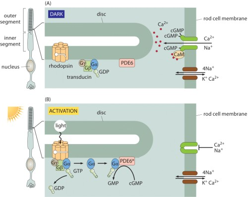

After each session you will find the solutions
to the notebooks [here](https://github.com/chrisfroe/readdy-workshop-2017-solutions).

## Monday - Setup & get started

### Task 0)

We go through the installation and the basic features of readdy step by step.

### Task 1)

Register a piecewise harmonic potential for A particles that live
on a 2D membrane
```python
sim.periodic_boundary = [True, True, True]
sim.kbt = 1.
sim.box_size = api.Vec(30., 30., 20.)

# register particle type
particle_radius = 0.5
sim.register_particle_type("A", 0.2, particle_radius)

# the potential that confines particles
origin = np.array([-16.,-16.,-0.001])
extent = np.array([32.,32.,0.002])
sim.register_potential_box("A", 200., api.Vec(*origin), api.Vec(*extent), False)

# the pairwise interaction
sim.register_potential_piecewise_weak_interaction(
    "A", "A", force_constant=20., desired_particle_distance=2.*particle_radius,
    depth=0.93, no_interaction_distance=4.*particle_radius
)

# add particles
rnd = np.random.uniform
for i in range(100):
    pos = np.array([-10., -10., 0.]) + rnd(size=3) * np.array([20.,20.,0.])
    sim.add_particle("A", api.Vec(*pos))

```

Perform a simulation and observe the radial distribution

```python
# define observables and run
traj_handle = sim.register_observable_flat_trajectory(stride=10)

rdf_data = []
def get_rdf(x):
    global rdf_data
    rdf_data.append(x)

rdf_handle = sim.register_observable_radial_distribution(
    stride=100, bin_borders=np.arange(0.,7.,0.05), type_count_from=["A"],
    type_count_to=["A"], particle_to_density=1., callback=get_rdf
)
with cl.closing(api.File("./obs.h5", api.FileAction.CREATE, api.FileFlag.OVERWRITE)) as f:
    traj_handle.enable_write_to_file(file=f, data_set_name="traj", chunk_size=10000)
    t1 = time.perf_counter()
    sim.run_scheme_readdy(True) \
        .write_config_to_file(f) \
        .with_reaction_scheduler("UncontrolledApproximation") \
        .with_skin_size(3.) \
        .configure_and_run(50000, 0.005)
    t2 = time.perf_counter()
    print("Simulated", t2 - t1, "seconds")
```

Obtain the __mean__ radial distribution function
```python
rdfs = np.array([x[1] for x in rdf_data])
bins = np.array(rdf_data[0][0])
n_rdfs = len(rdfs)
mean_rdfs = np.sum(rdfs, axis=0) / n_rdfs
```

From the radial distribution, estimate how the pair-potential looks like, assuming

$$ g(r) \propto e^{-U(r)}$$

What could be a source of error? Did you really find the true potential or rather an effective potential?

## Tuesday - Rhodopsin activation toy model

{: .centered}


(image from http://book.bionumbers.org/how-many-rhodopsin-molecules-are-in-a-rod-cell/)

Consider the following system: On a cubic membrane (of edge __length 14__, __force constant 100__), Rhodopsin (R) and G-proteins (G) diffuse freely. There is one rhodopsin which has been activated (by absorbing light), we call it RA. This acivated rhodopsin can activate G-proteins, called GA. (This will cause a whole cascade of chemical signaling and eventually a neuronal signal, which we will not model here. The actual mechanism of activation and interaction between R and G can be modeled with much more detail.)

{: .centered}


Register the following species

| species | diffusion | radius | initial numbers |
|:--------|:----------|:-------|:----------------|
| R       | 0.1       | 0.5    | 60              |
| RA      | 0.1       | 0.5    | 1               |
| G       | 0.1       | 0.5    | 60              |
| GA      | 0.1       | 0.5    | 0               |

The activation process is modeled as an __enzymatic reaction__

$$G + RA \rightarrow GA + RA$$

with __rate 5__ and __reaction radius 1__. You can register it like
```python
sim.register_reaction_enzymatic(
    label="activation", catalyst_type="RA",
    from_type="G", to_type="GA", rate=5., educt_distance=1.
)
```

### Task 1)

Observe and plot the numbers of GA particles as a function of time.
The time range shall be $t=[0,500]$. For an integration step of $\tau=0.005$, this
corresponds to performing 100000 integration steps.
Initially all particles are uniformly distributed on the membrane and a __single RA particle__ is placed in the center (0,0,0).

Make use of the observable `NParticles`. The execution of the simulation should look like:
```python
# define observables and run
numbers_ga = []
traj_handle = sim.register_observable_flat_trajectory(stride=10)
sim.register_observable_n_particles(
    stride=10, types=["GA"],
    callback=lambda x: numbers_ga.append(x[0])
)
with cl.closing(api.File("./obs.h5", api.FileAction.CREATE, api.FileFlag.OVERWRITE)) as f:
    traj_handle.enable_write_to_file(
        file=f,
        data_set_name="traj",
        chunk_size=1000
    )
    t1 = time.perf_counter()
    sim.run_scheme_readdy(True) \
        .write_config_to_file(f) \
        .with_reaction_scheduler("UncontrolledApproximation") \
        .configure_and_run(100000, 0.005)
    t2 = time.perf_counter()
print("Simulated", t2 - t1, "seconds")
```

### Task 2)

Plot the __mean__ (gather the results of multiple simulations and average) number of GA as a function of time.

Hint: wrap the complete simulation procedure in a single function, that returns the numbers of GA as a function of time (i.e. an array of numbers). Then you can perform this function several times, gather the results and average them.

How long does it take to activate the first 10 G-proteins? How long for the first 20 G-proteins?

### Task 3)

Same as task 2, but now introduce a __harmonic repulsion__ with __force constant 100__ between all particles __except__ between G and RA.

```python
force_const = 100.
sim.register_potential_harmonic_repulsion("RA", "R", force_const)
sim.register_potential_harmonic_repulsion("G", "R", force_const)
sim.register_potential_harmonic_repulsion("GA", "R", force_const)
sim.register_potential_harmonic_repulsion("G", "GA", force_const)
sim.register_potential_harmonic_repulsion("GA", "RA", force_const)
```

How does the mean production of GA compare to before?

### Bonus task)

Find the analytic expression for the time-dependent GA concentration. No computation needed, only pen and paper. Hint:
State the law of mass action for the concentrations of G and GA under the given enzymatic
reaction (with some rate $\kappa$) and make use of the conservation of particles.

Plot your analytic solution for some suitable parameters together with the results of the previous tasks, and judge if the law of mass action is an appropriate model for this system.
