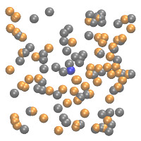

After each session you will find the solutions
to the notebooks [here](https://github.com/chrisfroe/readdy-workshop-2017-solutions).

## Monday - Setup & get started

__Task 0)__

We go through the installation and the basic features of readdy step by step.

__Task 1)__

Register a piecewise harmonic potential. Perform a simulation on a 2D membrane. From the radial distribution, estimate how this potential looks like, assuming

$$ g(r) \propto e^{-U(r)}$$

What could be a source of error? Did you really find the true potential or rather an effective potential?

Hint: your run loop should look like
```python
# define observables and run
traj_handle = sim.register_observable_flat_trajectory(stride=10)

rdf_data = []
def get_rdf(x):
    global rdf_data
    rdf_data.append(x)

rdf_handle = sim.register_observable_radial_distribution(
    stride=100, bin_borders=np.arange(0.,7.,0.05), type_count_from=["A"],
    type_count_to=["A"], particle_to_density=1., callback=get_rdf
)
with cl.closing(api.File("./obs.h5", api.FileAction.CREATE, api.FileFlag.OVERWRITE)) as f:
    traj_handle.enable_write_to_file(file=f, data_set_name="traj", chunk_size=10000)
    t1 = time.perf_counter()
    sim.run_scheme_readdy(True) \
        .write_config_to_file(f) \
        .with_reaction_scheduler("UncontrolledApproximation") \
        .with_skin_size(3.) \
        .configure_and_run(50000, 0.005)
    t2 = time.perf_counter()
    print("Simulated", t2 - t1, "seconds")
```


## Tuesday - Rhodopsin activation toy model

{: .centered}


Consider the following system: On a cubic membrane (of edge __length 14__, __force constant 100__), Rhodopsin (R) and G-proteins (G) diffuse freely. There is one rhodopsin which has been activated (by absorbing light), we call it RA. This acivated rhodopsin can activate G-proteins, called GA. (This will cause a whole cascade of chemical signaling and eventually a neuronal signal, which we will not model here. The actual mechanism of activation and interaction between R and G can be modeled with much more detail.)

The activation process is modeled as an __enzymatic reaction__

$$G + RA \rightarrow GA + RA$$

with __rate 5__ and __reaction radius 1__. You shall use the following parameters

| species | diffusion | radius | initial numbers |
|:--------|:----------|:-------|:----------------|
| R       | 0.1       | 0.5    | 60              |
| RA      | 0.1       | 0.5    | 1               |
| G       | 0.1       | 0.5    | 60              |
| GA      | 0.1       | 0.5    | 0               |

__Task 1)__

Plot the mean (gather the results of multiple simulations and average) production of GA as a function of time.
The time range shall be $t=[0,500]$. For an integration step of $\tau=0.005$, this
corresponds to performing 100000 integration steps.
Initially all particles are uniformly distributed on the membrane and the single RA is placed in the center (0,0,0).

How long does it take to activate the first 10 G-proteins? How long for the first 20 G-proteins?

__Task 2)__

Same as task 1, but now introduce a __harmonic repulsion__ with __force constant 100__ between the activated rhodopsin and the other rhodopsins.

How does the mean production of GA compare to before?

__Bonus task)__

Find the analytic expression for the time-dependent GA concentration. No computation needed, only pen and paper. Hint:
State the law of mass action for the concentrations of G and GA under the given enzymatic
reaction (with some rate $\kappa$) and make use of the conservation of particles.

Plot your analytic solution for some suitable parameters together with the results of the previous tasks.

