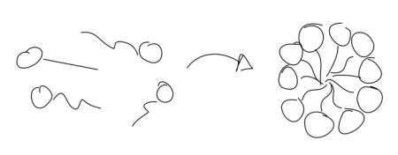

After each session you will find the solutions
to the notebooks [here](https://github.com/chrisfroe/readdy-workshop-2017-solutions).

## Monday - Setup & get started

### Task 0)

We go through the installation and the basic features of readdy step by step.

### Task 1)

Register a piecewise harmonic potential for A particles that live
on a 2D membrane
```python
sim.periodic_boundary = [True, True, True]
sim.kbt = 1.
sim.box_size = api.Vec(30., 30., 20.)

# register particle type
particle_radius = 0.5
sim.register_particle_type("A", 0.2, particle_radius)

# the potential that confines particles
origin = np.array([-16.,-16.,-0.001])
extent = np.array([32.,32.,0.002])
sim.register_potential_box("A", 200., api.Vec(*origin), api.Vec(*extent), False)

# the pairwise interaction
sim.register_potential_piecewise_weak_interaction(
    "A", "A", force_constant=20., desired_particle_distance=2.*particle_radius,
    depth=0.93, no_interaction_distance=4.*particle_radius
)

# add particles
rnd = np.random.uniform
for i in range(100):
    pos = np.array([-10., -10., 0.]) + rnd(size=3) * np.array([20.,20.,0.])
    sim.add_particle("A", api.Vec(*pos))

```

Perform a simulation and observe the radial distribution

```python
# define observables and run
traj_handle = sim.register_observable_flat_trajectory(stride=10)

rdf_data = []
def get_rdf(x):
    global rdf_data
    rdf_data.append(x)

rdf_handle = sim.register_observable_radial_distribution(
    stride=100, bin_borders=np.arange(0.,7.,0.05), type_count_from=["A"],
    type_count_to=["A"], particle_to_density=1., callback=get_rdf
)
with cl.closing(api.File("./obs.h5", api.FileAction.CREATE, api.FileFlag.OVERWRITE)) as f:
    traj_handle.enable_write_to_file(file=f, data_set_name="traj", chunk_size=10000)
    t1 = time.perf_counter()
    sim.run_scheme_readdy(True) \
        .write_config_to_file(f) \
        .with_reaction_scheduler("UncontrolledApproximation") \
        .with_skin_size(3.) \
        .configure_and_run(50000, 0.005)
    t2 = time.perf_counter()
    print("Simulated", t2 - t1, "seconds")
```

Obtain the __mean__ radial distribution function
```python
rdfs = np.array([x[1] for x in rdf_data])
bins = np.array(rdf_data[0][0])
n_rdfs = len(rdfs)
mean_rdfs = np.sum(rdfs, axis=0) / n_rdfs
```

From the radial distribution, estimate how the pair-potential looks like, assuming

$$ g(r) \propto e^{-U(r)}$$

What could be a source of error? Did you really find the true potential or rather an effective potential?

## Tuesday - Rhodopsin activation toy model

{: .centered}


(image from http://book.bionumbers.org/how-many-rhodopsin-molecules-are-in-a-rod-cell/)

Consider the following system: On a cubic membrane (of edge __length 14__, __force constant 100__), Rhodopsin (R) and G-proteins (G) diffuse freely. There is one rhodopsin which has been activated (by absorbing light), we call it RA. This acivated rhodopsin can activate G-proteins, called GA. (This will cause a whole cascade of chemical signaling and eventually a neuronal signal, which we will not model here. The actual mechanism of activation and interaction between R and G can be modeled with much more detail.)

{: .centered}


Register the following species

| species | diffusion | radius | initial numbers |
|:--------|:----------|:-------|:----------------|
| R       | 0.1       | 0.5    | 60              |
| RA      | 0.1       | 0.5    | 1               |
| G       | 0.1       | 0.5    | 60              |
| GA      | 0.1       | 0.5    | 0               |

The activation process is modeled as an __enzymatic reaction__

$$G + RA \rightarrow GA + RA$$

with __rate 5__ and __reaction radius 1__. You can register it like
```python
sim.register_reaction_enzymatic(
    label="activation", catalyst_type="RA",
    from_type="G", to_type="GA", rate=5., educt_distance=1.
)
```

### Task 1)

Observe and plot the numbers of GA particles as a function of time.
The time range shall be $t=[0,500]$. For an integration step of $\tau=0.005$, this
corresponds to performing 100000 integration steps.
Initially all particles are uniformly distributed on the membrane and a __single RA particle__ is placed in the center (0,0,0).

Make use of the observable `NParticles`. The execution of the simulation should look like:
```python
# define observables and run
numbers_ga = []
traj_handle = sim.register_observable_flat_trajectory(stride=10)
sim.register_observable_n_particles(
    stride=10, types=["GA"],
    callback=lambda x: numbers_ga.append(x[0])
)
with cl.closing(api.File("./obs.h5", api.FileAction.CREATE, api.FileFlag.OVERWRITE)) as f:
    traj_handle.enable_write_to_file(
        file=f,
        data_set_name="traj",
        chunk_size=1000
    )
    t1 = time.perf_counter()
    sim.run_scheme_readdy(True) \
        .write_config_to_file(f) \
        .with_reaction_scheduler("UncontrolledApproximation") \
        .configure_and_run(100000, 0.005)
    t2 = time.perf_counter()
print("Simulated", t2 - t1, "seconds")
```

### Task 2)

Plot the __mean__ (gather the results of multiple simulations and average) number of GA as a function of time.

Hint: wrap the complete simulation procedure in a single function, that returns the numbers of GA as a function of time (i.e. an array of numbers). Then you can perform this function several times, gather the results and average them.

How long does it take to activate the first 10 G-proteins? How long for the first 20 G-proteins?

### Task 3)

Same as task 2, but now introduce a __harmonic repulsion__ with __force constant 100__ between all particles __except__ between G and RA.

```python
force_const = 100.
sim.register_potential_harmonic_repulsion("RA", "R", force_const)
sim.register_potential_harmonic_repulsion("G", "R", force_const)
sim.register_potential_harmonic_repulsion("GA", "R", force_const)
sim.register_potential_harmonic_repulsion("G", "GA", force_const)
sim.register_potential_harmonic_repulsion("GA", "RA", force_const)
```

How does the mean production of GA compare to before?

### Bonus task)

Find the analytic expression for the time-dependent GA concentration. No computation needed, only pen and paper. Hint:
State the law of mass action for the concentrations of G and GA under the given enzymatic
reaction (with some rate $\kappa$) and make use of the conservation of particles.

Plot your analytic solution for some suitable parameters together with the results of the previous tasks, and judge if the law of mass action is an appropriate model for this system.

## Wednesday - Micellization

{: .centered}


Register a particle type A and a partially
attractive potential.
```python
# register particle type
particle_radius = 0.5
sim.register_particle_type("A", diffusion_coefficient=0.2, radius=particle_radius)

# the pairwise interaction
sim.register_potential_piecewise_weak_interaction(
    "A", "A", force_constant=20.,
    desired_particle_distance=2.*particle_radius,
    depth=2.0, no_interaction_distance=4.*particle_radius
)
```

As in the sessions before, consider a flat quadratic surface,
that confines particles. The surface has an __edge length 54__
and a __force constant 200__. You can use the code of the previous sessions to generate the box potential and to distribute particles uniformly, but make sure to use the correct lengths. Set the system temperature to __kbt = 0.8__.

### Task 1)

Distribute __200 A particles__ uniformly and simulate for 200000 timesteps of stepsize 0.005. Calculate the mean-squared-displacement (MSD) as a function of time. Therefore we will use the `Particles` observable and calculate the MSD from this ourselves.

The execution of the simulation should look as follows
```python
# define observables and run
traj_handle = sim.register_observable_flat_trajectory(stride=10)

particles_data = []
def get_particles(x):
    global particles_data
    particles_data.append(x)

handle = sim.register_observable_particles(stride=100, callback=get_particles)

with cl.closing(api.File("./obs.h5", api.FileAction.CREATE, api.FileFlag.OVERWRITE)) as f:
    traj_handle.enable_write_to_file(file=f, data_set_name="traj", chunk_size=10000)
    t1 = time.perf_counter()
    sim.run_scheme_readdy(True) \
        .write_config_to_file(f) \
        .with_reaction_scheduler("UncontrolledApproximation") \
        .configure_and_run(200000, 0.005)
    t2 = time.perf_counter()
print("Simulated", t2 - t1, "seconds")
```

To calculate the MSD from `particles_data` use the following function:
```python
def get_msd(particles_data):
    # obtain positions and ids as numpy arrays
    positions = []
    ids = []
    for t in range(len(particles_data)):
        positions.append(
            np.array([[x[0], x[1], x[2]] for x in particles_data[t][2]])
        )
        ids.append(
            np.array([x for x in particles_data[t][1]])
        )
    positions = np.array(positions)
    ids = np.array(ids)

    # sort the positions with respect to ids in each timestep,
    # since they might have changed the index in the positions array
    sorted_positions = np.zeros_like(positions)
    for t in range(len(ids)):
        sort_indices = np.argsort(ids[t])
        sorted_positions[t] = positions[t][sort_indices]

    # calculate the actual msd
    difference = sorted_positions - sorted_positions[0]
    squared = difference * difference
    squared_deviation = np.sum(squared, axis=2)
    n_particles = sorted_positions.shape[1]
    mean_squared_deviation = np.sum(squared_deviation, axis=1) / n_particles
    return mean_squared_deviation
```

From the MSD, give a rough estimate of the time it takes for the particles to cluster together.
Hint: you might want to look at the MSD in a log-log plot.


### Task 2)

...

To actually observe micellization we need a lipid-like structure. E.g. one head-particle bound to one or multiple tail-particles. Therefore use the __topologies__ feature.
To construct a topology you need to do an additional import at the top of your notebook
```python
import readdy._internal.readdybinding.api.top as top
```

Register two particle species that we need

| species | diffusion | radius | flavor                            |
|:--------|:----------|:-------|:----------------------------------|
| head    | 0.5       | 1.0    | `api.ParticleTypeFlavor.TOPOLOGY` |
| tail    | 0.5       | 0.5    | `api.ParticleTypeFlavor.TOPOLOGY` |

Both of these types should be attached to the 2D surface as in the task before
```python
# the potential that confines particles
origin = np.array([-28.,-28.,-0.001])
extent = np.array([54.,54.,0.002])
sim.register_potential_box("head", 200., api.Vec(*origin), api.Vec(*extent), False)
sim.register_potential_box("tail", 200., api.Vec(*origin), api.Vec(*extent), False)
```

The two types `head` and `tail` shall also interact via potentials
```python
# the pairwise interactions
sim.register_potential_piecewise_weak_interaction(
    "tail", "tail", force_constant=30., desired_particle_distance=2.*particle_radius,
    depth=2.0, no_interaction_distance=4.*particle_radius
)
sim.register_potential_harmonic_repulsion("head", "head", force_constant=30.)
```

Now let's build a topology, i.e. a group of particles, bonded together.
The first step is to configure how the particles within a topology interact
```python
# topologies configuration
sim.configure_topology_bond_potential("head", "tail", force_constant=50, length=1.)
sim.configure_topology_bond_potential("tail", "tail", force_constant=50, length=1.)
```

The final step is to add the topologies and their particles to the simulation. We will add
```python
# adding the topologies
rnd = np.random.uniform
for i in range(50):
    particles = []
    pos = origin + rnd(size=3) * extent
    particles.append(sim.create_topology_particle("head", api.Vec(*pos)))
    tail_orientation = rnd(size=3)
    particles.append(sim.create_topology_particle("tail", api.Vec(*(pos + tail_orientation))))
    particles.append(sim.create_topology_particle("tail", api.Vec(*(pos + 2.*tail_orientation))))
    topology = sim.add_topology(particles)
    topology.get_graph().add_edge(0, 1)
    topology.get_graph().add_edge(1, 2)
```

Now use the simulation execution from task 1, and also the MSD calculation from task 1. Run the simulation, have a look at the VMD output. What do you observe and why?

Look at the MSD and make an estimate at which timescale the lipids cluster together.
